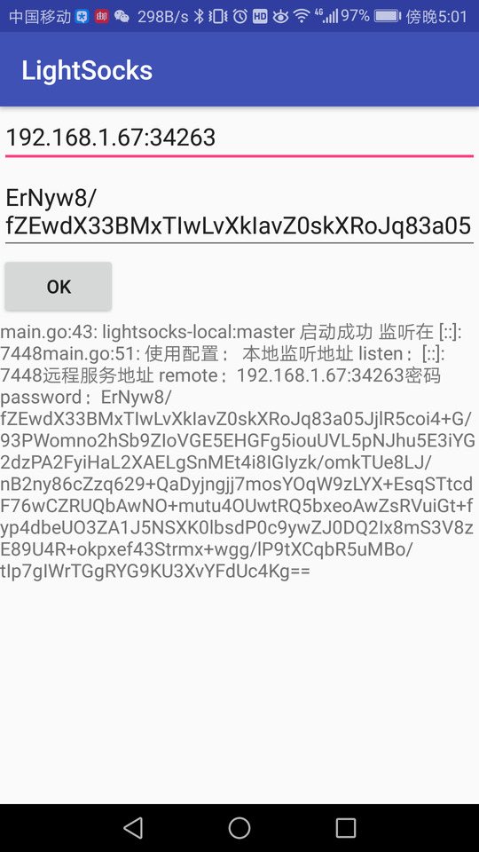

## [LightSocks](https://github.com/gwuhaolin/lightsocks) on Android

未完成

### TODO
- lightsocks依赖换为原版，在Java层生成/修改配置文件
- Android系统代理
- UI
- Service

### 类似项目

[Xsocks for Android](https://github.com/dosgo/xSocks-android)
